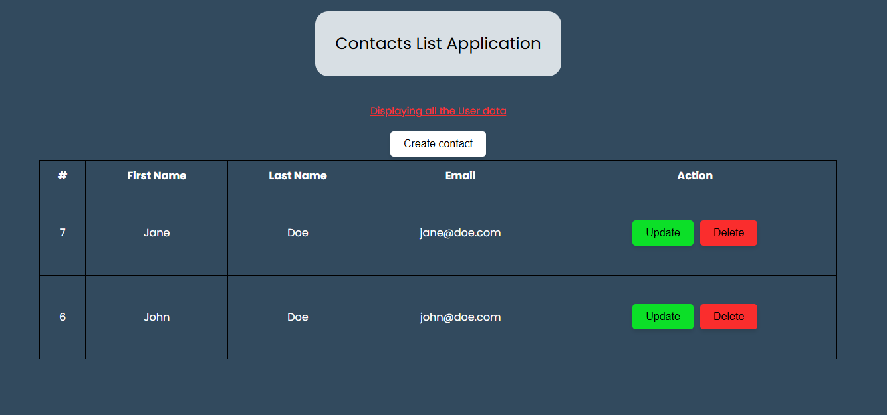
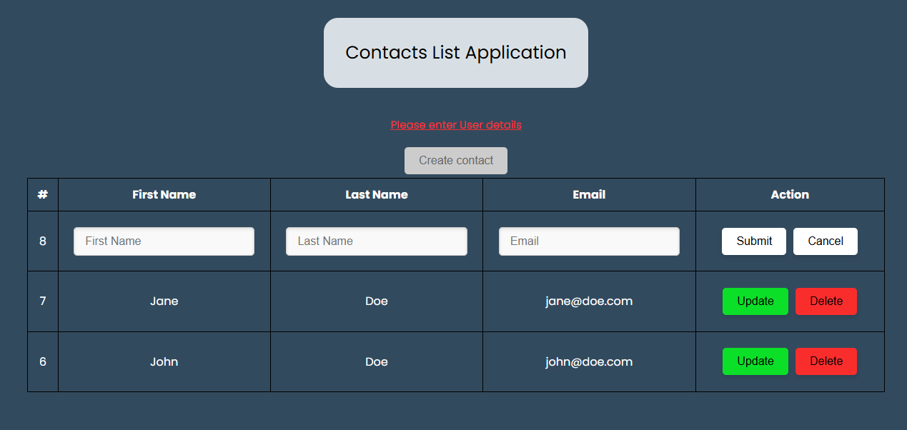
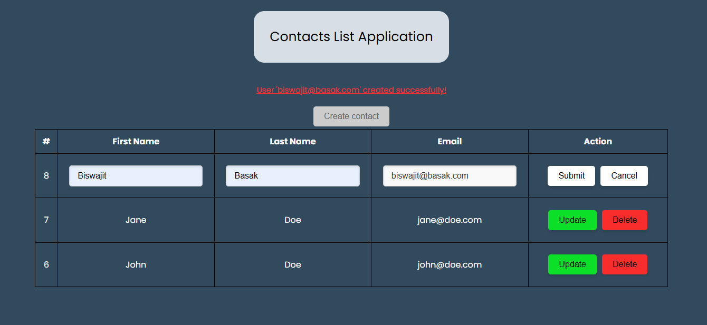
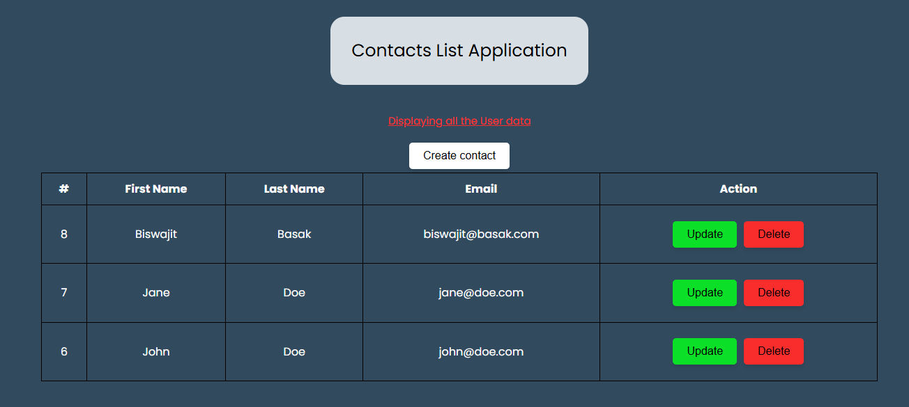
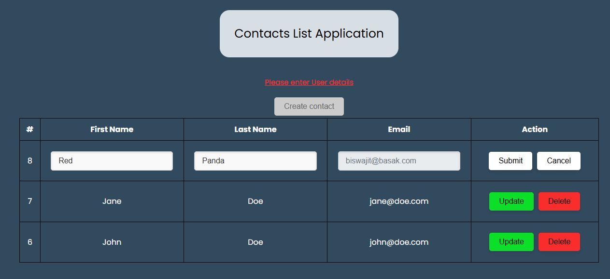
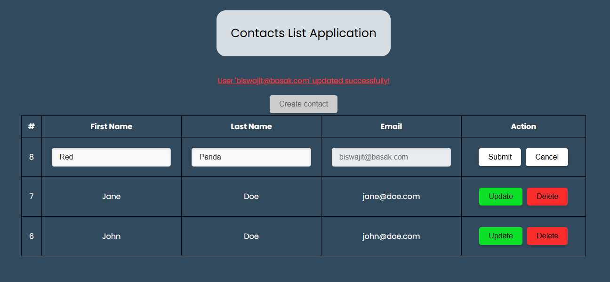
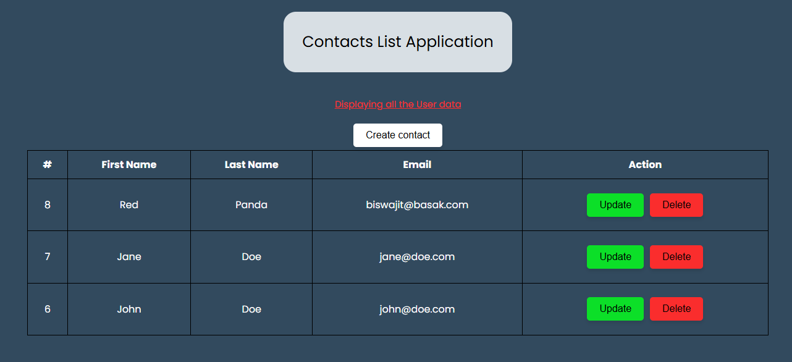

# Contact Board Application

## Homepage

## Create a new contact

## Update a contact

## Delete a contact

## Requirement List
1. The user should be able to enter their details i.e. First Name, Last Name and email into the system.
2. The user should be able to update their details in the system.
3. The user should be able to delete their details in the system.
4. The user should be able to view all user details.

## To execute the application, refer the below commands

- $ source venv/Scripts/activate
- $ pip install -r requirements.txt
- $ python main.py
- $ pyinstaller main.spec